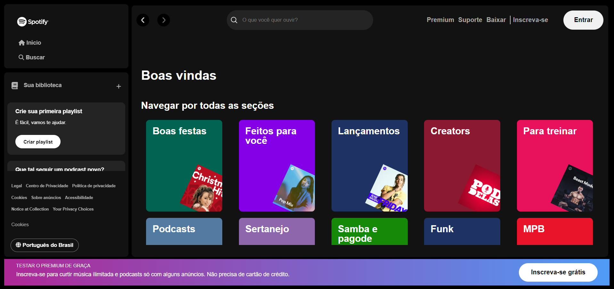
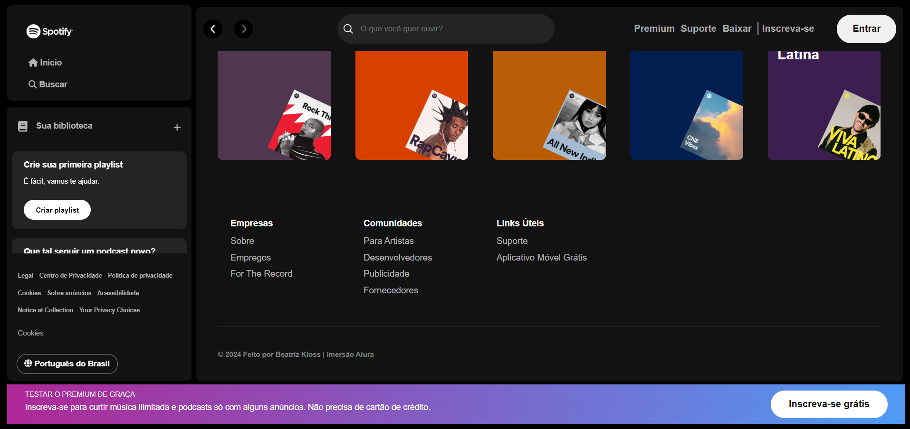

# Spotify React

O projeto consiste em clonar o site do Spotify.
Feito na Imersão Alura.

## Preview

## Como Funciona

O projeto utiliza de uma API para fazer a busca do Artista pelo seu nome.

## Link do projeto

[Deploy](https://spotify-reacty.vercel.app/)

## Execute a API

`npm install`
`json-server --watch api-artists/artists.json`
`npm start`
`Altere o "fetch" no arquivo App.jss para http://localhost:3000`
